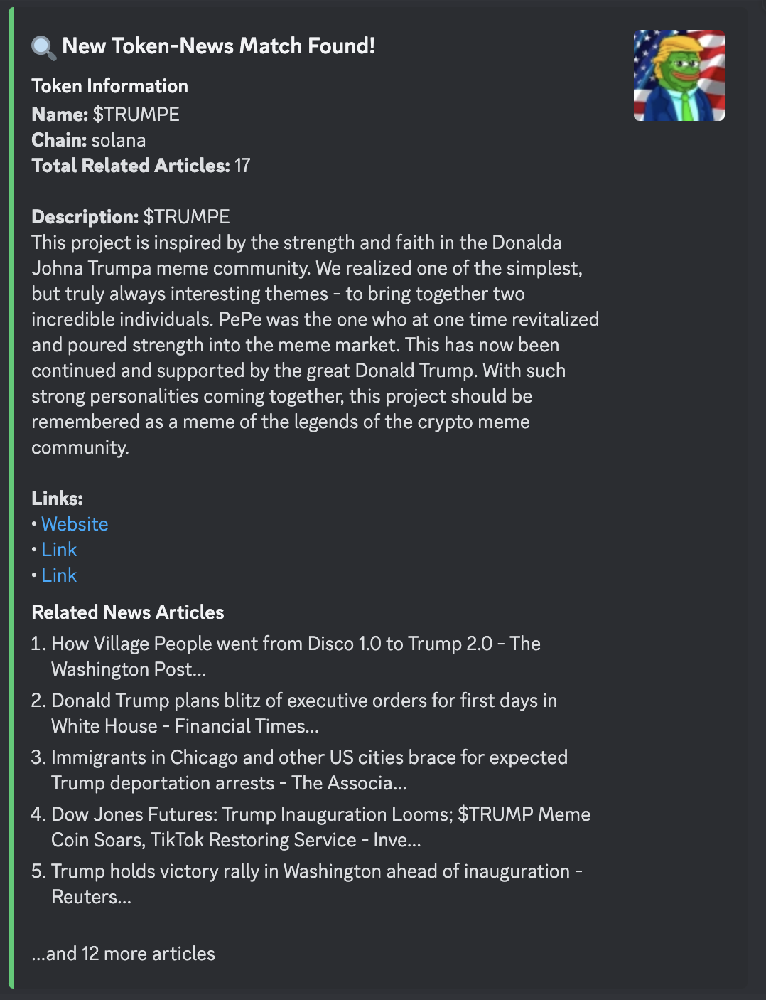

# Crypto News Token Monitor

This project monitors crypto news and newly listed tokens on DEXs, matching keywords to identify potential correlations and sending notifications via Discord.

## Setup

1. Install dependencies:
```bash
pip install -r requirements.txt
```

2. Create a `.env` file with your credentials:
```
APIFY_API_KEY=your_apify_key
DISCORD_BOT_TOKEN=your_discord_bot_token
DISCORD_CHANNEL_ID=your_channel_id
```

3. Run the main script:
```bash
python main.py
```

## Features

- News scraping using Apify
- DEX token monitoring
- Keyword matching using NLP
- Discord notifications
- Automated scheduling

## Requirements

- Python 3.8+
- Apify account
- Discord bot token
- Internet connection for API access

## Example Output

When a match is found between news articles and a token, you'll receive a Discord notification like this:



The notification includes:
- Token information (name, chain, description)
- Token image (if available)
- Total number of related articles
- Links to relevant resources
- Summary of the most relevant news articles
